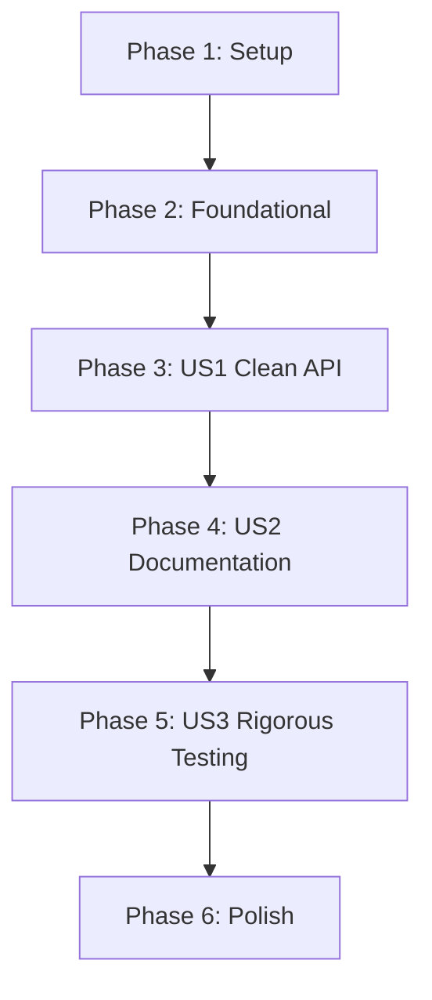

# Tasks: Integration and Polish

**Feature Branch**: `019-integration-polish`
**Status**: Ready
**Total Tasks**: 17

## Dependencies

## Phase 1: Setup

Goal: Initialize feature branch and prepare for audit.

- [x] T001 Create feature structure and register feature in changelog
- [x] T002 Audit current exports in `Pattern.Core` and `Pattern` to identify leaks
- [x] T003 Implement Checkpoint: Setup
  - **User Action**: `git add . && git commit -m "feat: setup integration and polish" && git push`

## Phase 2: Foundational

Goal: Establish strict export lists in core module.

- [x] T004 [P] Update `src/Pattern/Core.hs` module declaration to use explicit export list: `module Pattern.Core (exports...) where`
- [x] T005 Update `src/Pattern.hs` module declaration to re-export only public API from `Pattern.Core`
- [ ] T006 Implement Checkpoint: Foundational
  - **User Action**: `git add . && git commit -m "feat: enforce explicit export lists" && git push`
  - **Verification**: `cabal build` succeeds; `cabal repl pattern` shows only public API

## Phase 3: US1 - Clean Public API

Goal: Ensure the public API matches the `data-model.md` specification exactly.

- [ ] T007 [US1] Verify export of all Core Types and Constructors (`Pattern`, `pattern`, etc.) in `src/Pattern/Core.hs`
- [ ] T008 [US1] Verify export of all Query and Context functions (`length`, `extract`, etc.) in `src/Pattern/Core.hs`
- [ ] T009 [US1] Verify export of all Predicate and Typeclass instances in `src/Pattern/Core.hs`
- [ ] T010 [US1] Implement Checkpoint: API Polish
  - **User Action**: `git add . && git commit -m "feat: finalize public API surface" && git push`
  - **Verification**: Compare `cabal repl` output with `data-model.md`

## Phase 4: US2 - Comprehensive Documentation

Goal: 100% Haddock coverage with examples.

- [ ] T011 [US2] Audit and update Haddock docs for all exported functions in `src/Pattern/Core.hs`, ensuring `>>>` examples exist
- [ ] T012 [US2] Implement Checkpoint: Documentation
  - **User Action**: `git add . && git commit -m "feat: complete haddock documentation" && git push`
  - **Verification**: `cabal haddock` shows 100% coverage; examples render correctly

## Phase 5: US3 - Rigorous Testing

Goal: Verify all typeclass laws and edge cases.

- [ ] T013 [P] [US3] Verify property tests for `Functor`, `Applicative`, `Monad`, `Comonad`, `Traversable`, `Semigroup`, `Monoid` in `tests/Spec/Pattern/Properties.hs`
- [ ] T014 [P] [US3] Add explicit tests for edge cases (empty patterns, single elements, deep nesting) in `tests/Spec/Pattern/CoreSpec.hs` if missing
- [ ] T015 [US3] Implement Checkpoint: Testing
  - **User Action**: `git add . && git commit -m "feat: verify rigorous semantics" && git push`
  - **Verification**: `cabal test` passes with 0 failures

## Phase 6: Polish

Goal: Final clean up.

- [ ] T016 Remove any temporary comments or TODOs in source files
- [ ] T017 Implement Checkpoint: Final Polish
  - **User Action**: `git add . && git commit -m "feat: final polish" && git push`

